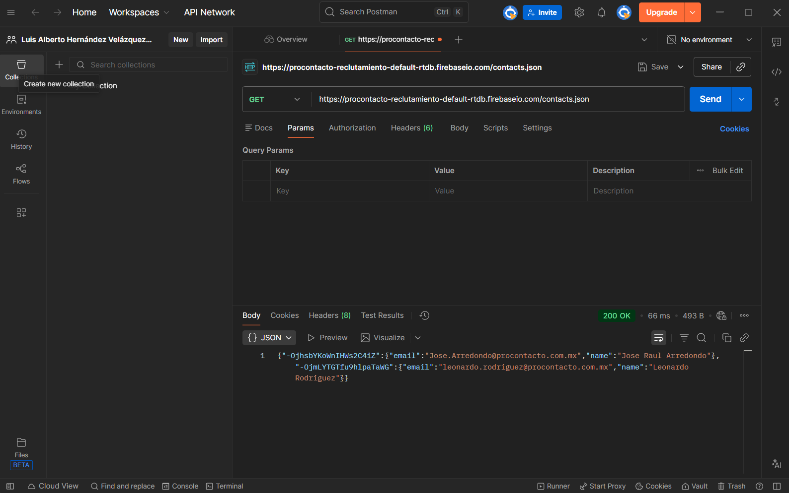
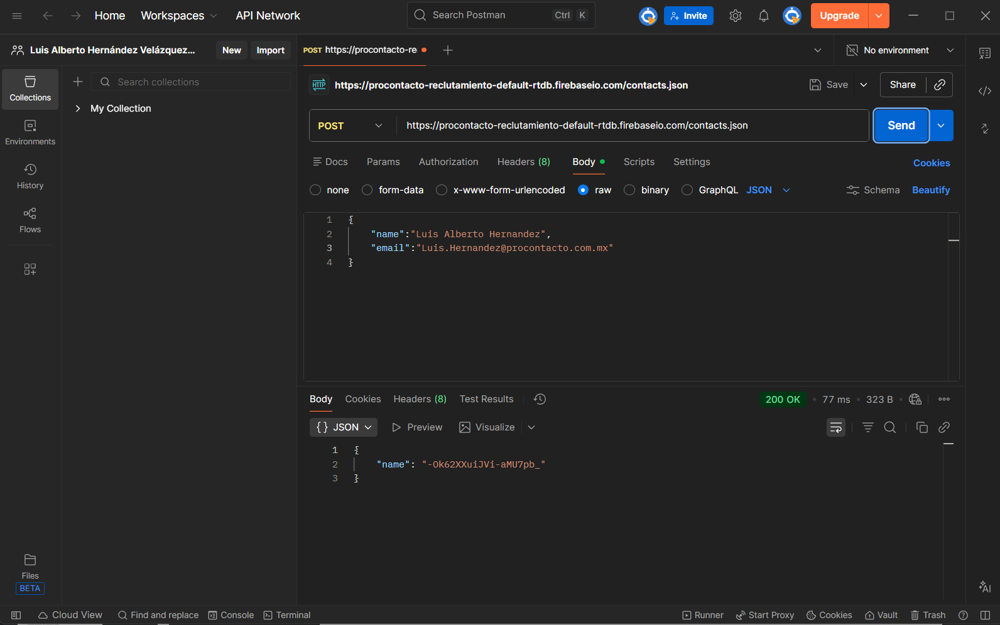
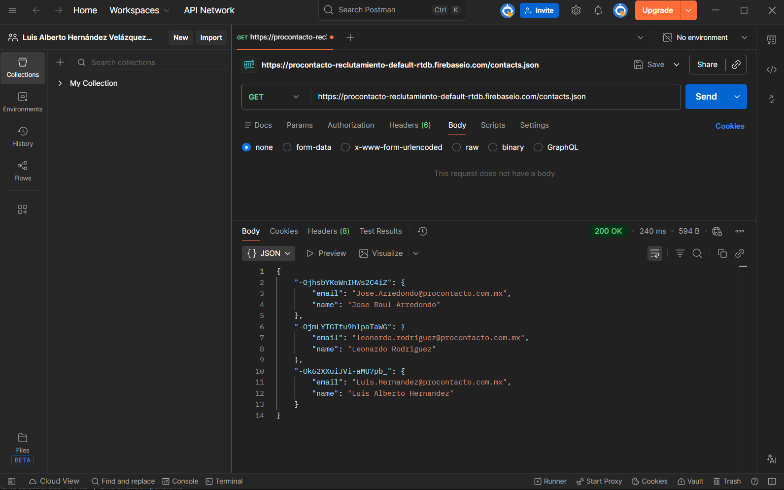
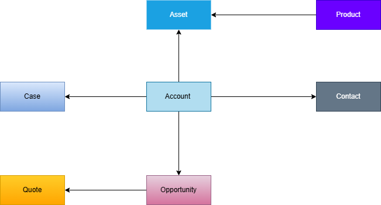
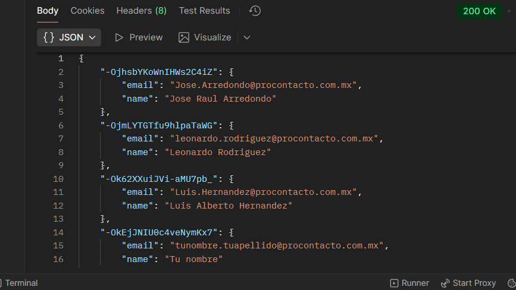
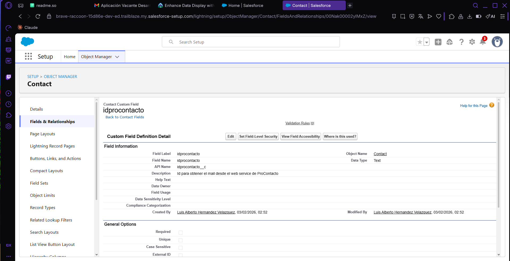
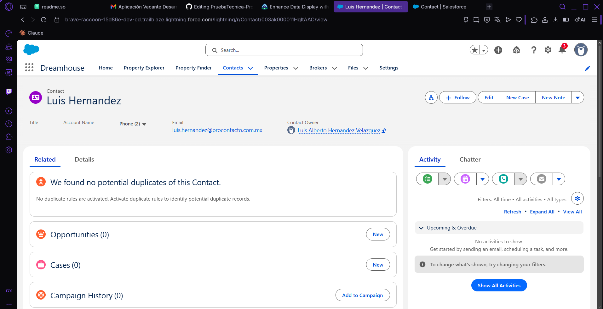

# Prueba Técnica para ProContacto

A continuación se muestra el desarrollo y solución de cada uno de los ejercicios solicitados en la prueba.

## Contenido de este README:
1. [Ejercicio 1.](#e1)
2. [Ejercicio 2.](#e2)
3. [Ejercicio 3.](#e3)
4. [Ejercicio 4.](#e4)
5. [Ejercicio 5.](#e5)
6. [Ejercicio 6.](#e6)
7. [Ejercicio 7.](#e7)

<a id="e1"></a>
## Ejercicio 1: Configuración de Herramientas

Las herramientas solicitadas ya las he trabajado anteriormente así que no fue necesario instalarlas, sin embargo adjunto pruebas de que ya cuento con ellas.

| Herramienta | Estado |
|-------------|--------|
| VS Code | Disponible |
| Git y Git Bash | Disponible |

## VS:


## Git y Git Bash:


<a id="e2"></a>
## Ejercicio 2: Preguntas Teóricas

### ¿Qué es un servidor HTTP?
Un servidor HTTP es un programa que escucha en un puerto y recibe peticiones del protocolo HTTP. En base al método o verbo HTTP procesa la solicitud y devuelve una respuesta con un código de estado (los cuales van del 100 al 599) y contenido en diversos formatos según la implementación: JSON, XML, HTML, archivos estáticos, etc.

### ¿Qué son los verbos HTTP?
El verbo en una petición HTTP es el componente que le permite al sistema saber cual es el objetivo de la peticion y asi mismo si debe esperar o mandar datos. Los mas conocidos son:

| Verbo | Descripción |
|-------|-------------|
| GET | Obtiene datos |
| POST | Crea un registro |
| PUT | Actualiza un registro completo |
| PATCH | Actualiza un registro parcialmente |
| DELETE | Elimina un registro |

### ¿Qué es un request y un response en una comunicación HTTP?
El request es la petición enviada al servidor HTTP, la cual contiene el método/verbo HTTP, la URL del recurso solicitado, headers y opcionalmente un body con datos o parámetros.

El response es la respuesta del servidor, que siempre incluye un código de estado HTTP (200, 404, 500, etc.), headers y normalmente un body con contenido en diversos formatos: JSON, XML, HTML, archivos, imágenes, etc.

### ¿Qué son los headers?
Los headers (encabezados) son metadatos que viajan tanto en el request como en el response de HTTP. Son información adicional sobre la petición o respuesta, pero no son el contenido principal. Son una herramienta que se utiliza principalmente para autorizaciones y seguridad del lado del usuario y del lado del servidor.

### ¿Qué es un queryString?
Es un segmento del url donde se transfieren datos al servidor para el correcto funcionamiento de la peticion solicitada (su uso usual es en las peticiones GET).

Ejemplo: `https://salesforce.com/buscar?nombre=Luis&rol=Becario`

El queryString es el segmento que esta después del endpoint y tiene los siguientes elementos:

| Elemento | Función |
|----------|---------|
| ? | Indica que inicia el queryString |
| = | Le asigna a cada parámetro su valor |
| & | Separa los parámetros |

### ¿Qué es el responseCode?
Es un número de tres dígitos que va desde 100 hasta 599, el cual es parte de la respuesta del servidor a una petición y que indica el estatus de la misma.

### ¿Qué significado tiene los posibles valores devueltos?

| Código | Categoría | Ejemplos |
|--------|-----------|----------|
| 1xx | Respuestas informativas | 100 Continue |
| 2xx | Éxito | 200 OK, 201 Created |
| 3xx | Redirecciones | 301 Moved Permanently, 304 Not Modified |
| 4xx | Errores del cliente | 400 Bad Request, 404 Not Found, 401 Unauthorized |
| 5xx | Errores del servidor | 500 Internal Server Error, 503 Service Unavailable |

### ¿Cómo se envía la data en un Get y cómo en un POST?

| Método | Dónde se envía | Formato |
|--------|---------------|---------|
| GET | QueryString (en la URL) | `?param1=valor1&param2=valor2` |
| POST | Body de la petición | JSON, XML, etc. |

### ¿Qué verbo http utiliza el navegador cuando accedemos a una página?
Cuando uno ingresa a una página mediante hipervínculos o desde la URL se hace una petición GET.

### ¿Qué es JSON?
JSON (JavaScript Object Notation) es un formato de transacción de datos basado en la sintaxis del lenguaje JavaScript, esto permite tener un formato ligero, legible y sencillo de estructurar, a pesar de tener su origen en este lenguaje se ha convertido en el estándar para el response de casi todos los endpoints funcionales actualmente.

Ejemplo de su estructura:
```json
{
    "nombre": "Luis Alberto",
    "edad": 20,
    "contratado": true
}
```

### ¿Qué es XML?
XML al igual que JSON es un formato de transacción de datos, este basado en una estructura similar a la de HTML estructurado y organizado por tags lo cual lo hace más estricto y verboso que su alternativa JSON.

Ejemplo de su estructura:
```xml
<becario>
    <nombre>Luis Alberto</nombre>
    <edad>20</edad>
    <contratado>true</contratado>
</becario>
```

### SOAP (Simple Object Access Protocol)
Es un protocolo de mensajería para el intercambio de información estructurada entre aplicaciones, el cual trabaja exclusivamente con el formato XML. Se caracteriza por los siguientes elementos:

**Estructura del mensaje:**
- Envelope: Envoltorio obligatorio que contiene todo el mensaje
- Header: Metadatos opcionales (autenticación, transacciones)
- Body: Contenido principal de la petición o respuesta

**Componentes clave:**
- WSDL (Web Services Description Language): Contrato formal que define todas las operaciones disponibles, qué parámetros reciben, en qué formato y qué respuestas devuelven
- XML Schema (XSD): Valida que los datos cumplan con el esquema definido
- WS-Security: Estándar de seguridad integrado

### REST (Representational State Transfer)
Es un estilo arquitectónico para diseñar servicios web que utiliza el protocolo HTTP y sus métodos estándar (GET, POST, PUT, DELETE). A diferencia de SOAP, REST es flexible, ligero y puede trabajar con múltiples formatos de datos, siendo JSON el más común.

**Características principales:**
- Stateless: Cada petición es independiente, el servidor no guarda estado entre peticiones
- Uso de métodos HTTP: GET, POST, PUT, DELETE
- Diferentes formatos: JSON, XML, HTML, texto plano, etc.
- URLs como recursos: Cada recurso tiene una URL única (`/salesforce/peticion/123`)
- Códigos de estado HTTP: 200 (OK), 404 (Not Found), 500 (Server Error), etc.

### Comparación SOAP vs REST

| Característica | SOAP | REST |
|----------------|------|------|
| Formato | XML exclusivo | JSON, XML, otros formatos |
| Protocolo | HTTP, SMTP, otros | Principalmente HTTP |
| Estado | Puede mantener estado | Stateless por diseño |
| Seguridad | WS-Security integrado | HTTPS, OAuth, otros |
| Rendimiento | Más pesado | Más ligero y rápido |
| Flexibilidad | Estricto (WSDL) | Flexible |

### ¿Qué son los headers en un request?
Cuando nosotros hacemos una petición de cualquier tipo, además de la información enviada mediante el body o queryString, se anexan datos que dan información adicional acerca de la petición, quién manda la petición, qué formato recibe la petición, qué formato se espera como respuesta, etc.

### ¿Para qué se utiliza el key Content-Type en un header?
Content-Type especifica qué formato se está enviando con la petición.

<a id="e3"></a>
## Ejercicio 3: Análisis de Peticiones HTTP
Este ejercicio nos pide hacer ciertas peticiones al siguiente endpoint: `https://procontacto-reclutamiento-default-rtdb.firebaseio.com/contacts.json`.

## Primera petición GET:


## Petición POST


## Segunda petición GET:


### Diferencias entre la primera y tercera petición
Cuando se hace la primera petición, obtenemos como resultado un JSON con dos registros. Sin embargo, entre la primera y la tercera petición se realiza una segunda, la cual es una petición POST que contiene el siguiente body:

```json
{
    "name": "Luis Alberto Hernandez",
    "email": "Luis.Hernandez@procontacto.com.mx"
}
```

Por lo que, al ser exitosa la petición, al volver a hacer una petición GET obtenemos como respuesta los tres registros.

### Resumen del Flujo

| Paso | Método | Resultado |
|------|--------|-----------|
| 1 | GET | 2 registros |
| 2 | POST | Agrega nuevo registro |
| 3 | GET | 3 registros (incluye el nuevo) |

<a id="e4"></a>
## Ejercicio 4: Trailhead Modules

Todos los módulos indicados en la prueba fueron realizados y lo podrán ver en el siguiente perfil: 
https://www.salesforce.com/trailblazer/kjxcktz155iik6xa7d

### Módulos Completados
- Salesforce Platform Basics
- Apex & .NET Basics
- Apex Basics & Database
- Data Modeling  
- Apex Triggers
- Apex Integration Services

<a id="e5"></a>
## Ejercicio 5: Objetos de Salesforce

### 1. Lead
Representa un prospecto o posible cliente que aún no ha sido calificado. Es el punto de entrada en el proceso de ventas para contactos potenciales no cualificados.

**Campos Principales:**
| Campo | Tipo | Descripción |
|-------|------|-------------|
| FirstName, LastName | Texto | Nombre y apellido del contacto |
| Company | Texto | Empresa a la que pertenece el lead |
| Email, Phone | Texto | Información de contacto |
| LeadSource | Picklist | Origen del lead (Web, Teléfono, Referencia, etc.) |
| Status | Picklist | Estado del lead (No contactado, Trabajando, Convertido, etc.) |
| Rating | Picklist | Calificación (Caliente, Tibio, Frío) |
| Industry | Picklist | Industria de la empresa |
| AnnualRevenue | Moneda | Ingresos anuales |
| NumberOfEmployees | Número | Número de empleados |
| Address fields | Dirección | Dirección completa |
| OwnerId | Lookup | Propietario del registro |
| ConvertedAccountId, ConvertedContactId, ConvertedOpportunityId | Lookup | IDs tras conversión |

**Relaciones:**
- Puede convertirse en: Account, Contact y Opportunity (relación de conversión)
- Puede relacionarse con: Campaign (para seguimiento de marketing)
- No se relaciona directamente con: Product, PriceBook, Quote, Asset, Case, Article

---

### 2. Account
Representa una organización, empresa o cuenta cliente. Es el objeto central para la gestión de relaciones comerciales y contiene información corporativa.

**Campos Principales:**
| Campo | Tipo | Descripción |
|-------|------|-------------|
| Name | Texto | Nombre de la empresa |
| AccountNumber | Texto | Número de cuenta único |
| Type | Picklist | Tipo (Cliente, Prospecto, Partner, Competidor, etc.) |
| Industry | Picklist | Sector industrial |
| AnnualRevenue | Moneda | Facturación anual |
| NumberOfEmployees | Número | Cantidad de empleados |
| Ownership | Picklist | Propiedad (Pública, Privada, Subsidiaria) |
| Phone, Fax, Website | Texto | Información de contacto |
| BillingAddress | Dirección | Dirección de facturación |
| ShippingAddress | Dirección | Dirección de envío |
| OwnerId | Lookup | Propietario de la cuenta |

**Relaciones:**
- Contiene (1:N): Contacts (obligatorio), Opportunities, Cases, Assets
- Relacionado con: Contracts (contratos)
- Base para: Todas las operaciones comerciales con la empresa

---

### 3. Contact
Representa a una persona específica dentro de una Account, generalmente un empleado o contacto comercial.

**Campos Principales:**
| Campo | Tipo | Descripción |
|-------|------|-------------|
| FirstName, LastName | Texto | Nombre completo |
| Title | Texto | Puesto/posición |
| Department | Texto | Departamento |
| Email, Phone, MobilePhone | Texto | Múltiples contactos |
| MailingAddress | Dirección | Dirección postal |
| OtherAddress | Dirección | Dirección alternativa |
| AccountId | Lookup | Relación obligatoria con Account |
| ReportsToId | Lookup | Jefe/reporta a (relación con otro Contact) |
| LeadSource | Picklist | Origen del contacto |
| Birthdate | Fecha | Fecha de nacimiento |

**Relaciones:**
- Pertenece a (N:1): Account (relación obligatoria)
- Puede ser: Contacto de Opportunity, Contacto reportante de Case
- Puede recibir: Quotes
- Puede usar: Assets

---

### 4. Opportunity
Representa una oportunidad de venta específica con un cliente existente. Es el objeto central del proceso de ventas.

**Campos Principales:**
| Campo | Tipo | Descripción |
|-------|------|-------------|
| Name | Texto | Nombre de la oportunidad |
| AccountId | Lookup | Account relacionada (obligatorio) |
| CloseDate | Fecha | Fecha estimada de cierre |
| StageName | Picklist | Etapa del proceso de ventas |
| Amount | Moneda | Monto estimado |
| Probability | Porcentaje | Probabilidad de cierre (%) |
| Type | Picklist | Tipo (Nuevo negocio, Renovación, etc.) |
| LeadSource | Picklist | Origen |
| NextStep | Texto | Siguiente paso |
| ForecastCategory | Picklist | Categoría de pronóstico |

**Relaciones:**
- Pertenece a (N:1): Account (obligatorio)
- Puede tener: Contact (Contacto de Oportunidad - opcional)
- Contiene (1:N): Opportunity Products (Productos de la oportunidad)
- Genera (1:N): Quotes
- Usa: PriceBook (lista de precios)

---

### 5. Product
Representa un producto o servicio vendible en el catálogo de la empresa. Es la definición maestra de un ítem.

**Campos Principales:**
| Campo | Tipo | Descripción |
|-------|------|-------------|
| Name | Texto | Nombre del producto |
| ProductCode | Texto | Código único del producto |
| Description | Texto largo | Descripción detallada |
| Family | Picklist | Familia de producto |
| IsActive | Checkbox | ¿Está activo para venta? |
| QuantityUnitOfMeasure | Picklist | Unidad de medida |
| DisplayUrl | URL | URL de imagen/display |

**Relaciones:**
- Existe independientemente en el catálogo
- Se asocia a: PriceBookEntries (precios en diferentes listas)
- Se agrega a: Opportunities, Quotes, Orders
- Instancia en: Assets (productos específicos vendidos)

---

### 6. PriceBook
Lista de precios que define productos disponibles y sus precios para diferentes mercados o clientes.

**Campos Principales:**
| Campo | Tipo | Descripción |
|-------|------|-------------|
| Name | Texto | Nombre de la lista de precios |
| Description | Texto | Descripción |
| IsActive | Checkbox | ¿Está activa? |
| IsStandard | Checkbox | ¿Es la lista de precios estándar? |

**Relaciones:**
- Contiene (1:N): PriceBookEntries (entradas de precio)
- Se asocia a: Opportunities (cada oportunidad usa un PriceBook)
- Se usa en: Quotes (para generar cotizaciones)
- Relacionado con: Products a través de PriceBookEntries

---

### 7. Quote
Cotización formal o propuesta comercial enviada a un cliente, generalmente generada desde una Opportunity.

**Campos Principales:**
| Campo | Tipo | Descripción |
|-------|------|-------------|
| Name | Texto | Nombre de la cotización |
| OpportunityId | Lookup | Opportunity origen (obligatorio) |
| Status | Picklist | Estado (Borrador, Enviado, Aprobado, Rechazado) |
| ExpirationDate | Fecha | Fecha de expiración |
| GrandTotal | Moneda | Total general |
| Tax | Moneda | Impuestos |
| Subtotal | Moneda | Subtotal |
| Discount | Moneda | Descuento |
| ContactId | Lookup | Contacto destinatario |
| QuoteNumber | Texto | Número de cotización |

**Relaciones:**
- Generada desde (N:1): Opportunity
- Enviada a: Contact (opcional)
- Usa (N:1): PriceBook
- Contiene (1:N): Quote Line Items (ítems de la cotización)
- Puede convertirse en: Order (pedido)

---

### 8. Asset
Representa un producto específico que un cliente ha comprado y posee. Es la instancia concreta de un Product.

**Campos Principales:**
| Campo | Tipo | Descripción |
|-------|------|-------------|
| Name | Texto | Nombre del activo |
| Product2Id | Lookup | Producto relacionado |
| AccountId | Lookup | Account dueña (obligatorio) |
| ContactId | Lookup | Contacto usuario (opcional) |
| SerialNumber | Texto | Número de serie |
| Price | Moneda | Precio de compra |
| PurchaseDate | Fecha | Fecha de compra |
| InstallDate | Fecha | Fecha de instalación |
| Status | Picklist | Estado (Comprado, Instalado, En garantía, Retirado) |
| UsageEndDate | Fecha | Fecha fin de uso |

**Relaciones:**
- Es instancia de (N:1): Product
- Pertenece a (N:1): Account (obligatorio)
- Usado por: Contact (opcional)
- Soporte en (1:N): Cases (casos de soporte)
- Puede venir de: Opportunity u Order

---

### 9. Case
Solicitud de soporte, consulta o incidencia de un cliente. Objeto central del servicio al cliente.

**Campos Principales:**
| Campo | Tipo | Descripción |
|-------|------|-------------|
| CaseNumber | Texto | Número de caso automático |
| Subject | Texto | Asunto |
| Description | Texto largo | Descripción detallada |
| Status | Picklist | Estado (Nuevo, En progreso, Cerrado, etc.) |
| Priority | Picklist | Prioridad (Baja, Media, Alta, Crítica) |
| Origin | Picklist | Origen (Teléfono, Email, Web, etc.) |
| AccountId | Lookup | Account relacionada (obligatorio) |
| ContactId | Lookup | Contacto reportante (opcional) |
| AssetId | Lookup | Asset relacionado (opcional) |
| Type | Picklist | Tipo de caso |
| Reason | Picklist | Razón |

**Relaciones:**
- Pertenece a (N:1): Account (obligatorio)
- Reportado por: Contact (opcional)
- Relacionado con: Asset (opcional)
- Usa: Articles de Knowledge (opcional)
- Puede escalar a: Entitlements (derechos de soporte)

---

### 10. Article
Artículo de la base de conocimiento (Knowledge Base) que contiene soluciones documentadas a problemas comunes.

**Campos Principales:**
| Campo | Tipo | Descripción |
|-------|------|-------------|
| Title | Texto | Título del artículo |
| UrlName | Texto | URL única |
| Summary | Texto | Resumen |
| KnowledgeArticleId | Texto | ID del artículo de conocimiento |
| ArticleType | Picklist | Tipo de artículo |
| Language | Picklist | Idioma |
| VersionNumber | Número | Número de versión |
| PublishStatus | Picklist | Estado de publicación |
| IsVisibleInPkb | Checkbox | ¿Visible en Knowledge Base pública? |
| IsVisibleInCsp | Checkbox | ¿Visible para socios? |
| IsVisibleInApp | Checkbox | ¿Visible en la aplicación? |

**Relaciones:**
- Generalmente independiente como recurso de conocimiento
- Se asocia a: Cases cuando se usa para resolver un caso
- Organizado en: Categorías de conocimiento
- Relacionado con: Products (artículos específicos de producto)
- Puede tener: Versiones y traducciones

### Esquema de relaciones
Anteriormente se presentó la descripción detallada de los objetos estándar de Salesforce, los cuales tienen múltiples relaciones entre sí. En este esquema, nos enfocaremos exclusivamente en las relaciones intrínsecas, aquellas que son fundamentales y definitorias de cada objeto según la configuración estándar de Salesforce, excluyendo relaciones opcionales o personalizadas.



<a id="e6"></a>
## Ejercicio 6: SalesForce
### Soluciones de Salesforce
### ¿Qué es Salesforce?
Salesforce es un CRM en la nube, es decir, es una plataforma que ayuda a las empresas a gestionar su relación con clientes potenciales o ya adquiridos.

Sin embargo, Salesforce ha evolucionado para ser más que una plataforma de gestión de clientes; es un ecosistema que puede ayudar a integrar la información de una corporación entera, desde el área de recursos humanos hasta los departamentos de TI.

Lo más destacado es que, como se mencionó anteriormente, es una plataforma en la nube. Esto significa que los clientes de Salesforce no necesitan adquirir hardware especial o potente, ni tendrán que instalar nada en sus equipos. Basta con que tengan conexión a internet.

### ¿Qué es Sales Cloud?
Sales Cloud ofrece herramientas y tecnologías para ayudar a los equipos de ventas a completar su trabajo con mayor facilidad. Estas funciones, que impulsan la productividad, se basan en la gestión de leads y oportunidades. Su objetivo final es vincular las actividades diarias con los resultados del negocio, como acortar los ciclos de venta, aumentar el tamaño promedio de las operaciones y cumplir o superar las cuotas.

Lo que hace atractivo a Sales Cloud para las empresas es su gran capacidad para automatizar tareas mediante su IA (Einstein) y las diversas herramientas integradas en la plataforma.

### ¿Qué es Service Cloud?
Service Cloud es la plataforma de Salesforce diseñada específicamente para la atención y el servicio al cliente. Su objetivo es transformar los centros de contacto tradicionales en centros de relaciones inteligentes, donde la experiencia del cliente sea más rápida, personalizada y eficiente en todos los canales.

Gracias a la implementación de IA el cliente tiene acceso a información de diversos departamentos lo que ofrece una vista de 360° al cliente.

### ¿Qué es Health Cloud?
Reúne los datos clínicos y no clínicos y activa experiencias de atención de la salud y ciencias biológicas más inteligentes y eficientes con el trabajo conjunto de humanos y agentes de IA. Utiliza las aplicaciones integradas y compatibles en los sectores de atención al cliente, ventas, equipos de atención, marketing y muchos más, para aumentar la productividad, ampliar la personalización y obtener acceso a terapias y tratamientos.

Ofrece una interacción personalizada con una vista unificada, una gestión inteligente del paciente y una experiencia de participación conectada.

### ¿Qué es Marketing Cloud?
Marketing Cloud es la suite de Salesforce para la automatización del marketing digital y la gestión de la experiencia del cliente a lo largo de todo su ciclo de vida. No es solo una herramienta de envío de emails, sino una plataforma integral para crear, ejecutar y analizar campañas de marketing personalizadas y omnicanal.

Mientras herramientas básicas se enfocan en el envío, Marketing Cloud se enfoca en la estrategia de datos y la orquestación de experiencias complejas a escala, integrada directamente con los datos de ventas y servicio de Salesforce.

### Funcionalidades de Salesforce
### ¿Qué es un RecordType?
Los RecordTypes son configuraciones que definen variaciones de negocio para un mismo objeto (estándar o personalizado). Para cada RecordType, puedes asignar un diseño de página diferente, campos específicos (incluyendo cuáles son obligatorios) y valores exclusivos en las listas de selección (picklists).

### ¿Qué es un ReportType?
ReportType determina qué registros y campos aparecen en un informe. Por ejemplo, el tipo de informe de Oportunidades te da acceso a registros y campos de Oportunidad como Monto, Etapa y Propietario de Oportunidad.

### ¿Qué es un Page Layout?
Los Page Layout permiten organizar campos en un orden lógico, así como establecer propiedades de campo, agregar botones, acciones y listas relacionadas. Estos pueden adaptarse a diferentes equipos dentro de tu organización para que cada rol pueda acceder a lo que necesita, más rápido.

### ¿Qué es un Compact Layout?
Compact Layout muestra los campos clave de un registro de un vistazo en la aplicación móvil de Salesforce, Lightning Experience y en las integraciones de Outlook y Gmail.

### ¿Qué es un Perfil?
Un Perfil es el componente fundamental de seguridad y personalización de la experiencia de usuario en Salesforce. Define qué puede ver y hacer un usuario dentro de la plataforma.

Cuando se crea un usuario, se le asigna un perfil, el cual establece sus permisos base y configuraciones predeterminadas.

### ¿Qué es un Rol?
El rol dentro de la plataforma Salesforce permite establecer jerarquías entre usuarios, esto se hace en todos lo tipos de perfiles.

Esto nos ayuda a poder asignar tareas apropiadas a cada usuario de acuerdo a su rol y poder dar seguridad a la visibilidad de los registros.

### ¿Qué es un Validation Rule?
Las Validation Rules nos permiten establecer validaciones para la seguridad e integridad de los registros en Salesforce.

Cada vez que se intenta ingresar o actualizar un registro, la Validation Rule evalúa los datos y, en caso de no cumplir con los criterios establecidos, no permite la inserción (o guardado) del registro y lanza un mensaje de error personalizado.

###  ¿Qué diferencia hay entre una relación Master Detail y Lookup?

Lookup nos permite relacionar dos objetos que pueden funcionar de manera independiente, su integridad y funcionalidad no están forzadas.

Master-Detail establece una relación de composición entre dos objetos, donde los registros Detail dependen por completo del registro Master. Comparten el mismo ciclo de vida: si se elimina el registro Master, todos sus registros Detail relacionados también se eliminan.

### ¿Qué es un Sandbox?

Un Sandbox es una réplica del sistema de una organización, utilizada para desarrollar y probar nuevas implementaciones sin poner en riesgo la integridad del ecosistema que ya está en funcionamiento.

### ¿Qué es un ChangeSet?
Un ChangeSet es una herramienta de despliegue que nos permite migrar cambios de metadatos (previamente probados en un Sandbox) hacia el entorno de producción u otro entorno de Salesforce.

Los ChangeSet solo permiten migrar configuraciones, objetos, campos, clases Apex, flujos, etc. No permiten enviar registros.

### ¿Para qué sirve el import Wizard de Salesforce?
Import Wizard es una herramienta que nos provee SalesForce para poder importar datos masivamente (hasta 50,000 registros) mediante el uso de archivos CSV.

Permite hacer todas las operaciones DML:
+ Insert
+ Update
+ Upsert
+ Delete 

### ¿Para qué sirve la funcionalidad Web to Lead?
Web to Lead nos permite obtener los datos que ingresen a una pagina web para poder ingresarlos al ecosistema de Salesforce de nuestra organización como un Lead.

### ¿Para qué sirve la funcionalidad Web to Case?
Similar a la funcionalidad anterior, permite automatizar el registro de quejas o incidencias registradas en la pagina web de nuestra organización y mapearlos como objetos Case en nuestro ecosistema Salesforce.

### ¿Para qué sirve la funcionalidad Omnichannel?

Omnichannel permite a una empresa u organización integrar todos sus canales de comunicación en una plataforma unificada de Salesforce. Su objetivo es proporcionar al cliente una experiencia fluida y coherente, sin importar por qué canal se contacte, ya sea para realizar una compra, levantar una queja o solicitar soporte.

Al utilizar Omnichannel, los agentes pueden dar seguimiento a las peticiones del cliente sin que este tenga que repetir información, ya que todas las interacciones anteriores y los datos relevantes están centralizados en un solo lugar.

### ¿Para qué sirve la funcionalidad Chatter?
Chatter es la red social corporativa integrada en Salesforce que permite la colaboración en tiempo real entre usuarios, equipos y registros de datos dentro de la plataforma.

### Conceptos generales
### ¿Qué significa SaaS?
Un SaaS (Software as a Service) es un modelo de distribución donde los proveedores ofrecen su software como un servicio, el cual está alojado en la nube. Esto permite a los clientes acceder a la aplicación mediante un navegador web sin tener que preocuparse por los requerimientos de hardware, mantenimiento o instalaciones locales.

### ¿Salesforce es Saas?
Sí, Salesforce entra dentro de la categoría SaaS. De hecho, Salesforce es uno de los ejemplos más destacados cuando se habla de productos SaaS, ya que para acceder a todas las herramientas y funcionalidades se tiene que pagar una suscripción o tarifa.

### ¿Qué significa que una solución sea Cloud?

Significa que el servicio o software no requiere de hardware específico, instalación local o mantenimiento en servidores físicos propios, ya que toda la infraestructura y la solución están alojadas y gestionadas en centros de datos remotos, a los que se accede principalmente a través de internet.

### ¿Qué significa que una solución sea On-Premise?

Opuesto al punto anterior, que una solución sea On-Premise significa que el software o servicio sea alojado y gestionado dentro de la infraestructura física de la empresa.

### ¿Qué es un pipeline de ventas?
El pipeline de ventas es una herramienta de gestión que te permite organizar de forma visual y dinámica el flujo de ventas de tu empresa, de manera que sea posible seguir el progreso de los leads a lo largo de las diferentes etapas que componen el proceso de ventas. En otras palabras, el pipeline refleja el movimiento de cada cliente potencial, desde su primer contacto con la marca hasta la etapa de postventa.

###  ¿Qué es un funnel de ventas?
El concepto de funnel de ventas representa todo el proceso de cierre de un negocio, desde el momento de la captación hasta la conversión final.

Es el acompañamiento de un cliente desde el momento en que tiene el primer contacto con los productos o servicios de tu empresa hasta el momento en que la venta es cerrada.

### ¿Qué significa Customer Experience?
Es un concepto que abarca cada interacción que un cliente tiene con su marca, desde el primer contacto hasta el soporte continuo. Es la percepción general que un cliente se forma a partir de sus interacciones con su marketing, productos, servicios y la forma en que su equipo atiende sus necesidades.

### ¿Qué significa omnicanalidad?
La omnicanalidad es la integracion estratégica de todos nuestros medios de comunicación para ofrecerle a nuestros clientes una experiencia fluida y personalizada a la hora de hacer acciones que abarcan desde el alta de una queja hasta la realizacion de una venta.

### ¿Qué significa que un negocio sea B2B?
Un negocio B2B (Business-to-Business) es aquel cuya clientela objetivo principal son otras empresas u organizaciones, no consumidores finales individuales. Su enfoque está en proveer productos, servicios o soluciones que ayudan a otras empresas a operar, crecer o mejorar sus procesos.

### ¿Qué significa que un negocio sea B2C?
Un negocio B2C (Business-to-Consumer) es aquel que vende productos o servicios directamente al consumidor final individual para su uso personal, no para operar un negocio. Es el modelo comercial más común y visible en la vida cotidiana.

### ¿Qué es un KPI?
Un KPI (Key Performance Indicator) es una métrica cuantitativa que muestra cómo tu equipo o empresa progresa hacia tus objetivos empresariales más importantes.

### ¿Qué es una API y en qué se diferencia de una Rest API?
Una API (Application Programming Interface o Interfaz de Programación de Aplicaciones) es un conjunto de reglas, protocolos y herramientas que permite que dos componentes de software se comuniquen entre sí. Actúa como un mensajero que toma una solicitud, la traduce y devuelve una respuesta entre sistemas.

La diferencia que hay entre una API y una API Rest es que como tal no son conceptos independientes, ya que una API Rest es una forma de diseñar e implementar API´s. Es el estándar más común para API´s web modernas.

###  ¿Qué es un Proceso Batch?
Un proceso Batch es el método que utilizan las computadoras para completar periódicamente trabajos de datos repetitivos y de gran volumen. Esto nos es útil ya que ciertas tareas de procesamiento de datos, como las copias de seguridad, el filtrado y la clasificación, pueden requerir un esfuerzo de computación intensivo y ser ineficientes para ejecutarse en transacciones de datos individuales.

### ¿Qué es Kanban?
Kanban es un método visual y ágil de gestión del trabajo que permite visualizar el flujo de tareas, limitar el trabajo en progreso (WIP) y maximizar la eficiencia del equipo. Su nombre proviene del japonés y significa "tarjeta visual".

### ¿Qué es un ERP?
Un ERP (Enterprise Resource Planning) son aquellos software que tienen la capacidad de hacerse cargo de distintas operaciones internas de una empresa, desde producción a distribución o incluso los recursos humanos.

### ¿Salesforce es un ERP?
No, ya que esta enfocada particularmente en la relación e interacciones que tiene el cliente con nuestra organización.

<a id="e7"></a>
## Ejercicio 7: Ejercicio Integrador
Este último ejercicio fue, sin ninguna duda, el más desafiante pero a la vez más enriquecedor, ya que me permitió reforzar lo aprendido en los módulos solicitados en el [Ejercicio 4](#e4), además de enfrentarme a dificultades reales a la hora de desarrollar e implementar funcionalidades para Salesforce.

### Obtención del id de ProContacto


### Creación del field "idprocontacto"


### Código
### Clase: EjercicioIntegrador

Esta clase tiene como objetivo generar y procesar una petición GET al endpoint:
`https://procontacto-reclutamiento-default-rtdb.firebaseio.com/contacts/IdDeProContacto.json`.

La petición permite obtener el correo electrónico de los usuarios de ProContacto mediante su ID.

Adicionalmente, la clase incluye un método auxiliar que crea un objeto de tipo Contact para realizar pruebas del método principal.
```
public class EjercicioIntegrador {
	public static Map<String,String> obtenerEmailsPorIds(List<String> idsProContacto){
        Map<String,String> emails = new Map<String,String>();
        Http http = new Http();
        for(String idProContacto : idsProContacto){
        	HttpRequest request = new HttpRequest();
        	request.setEndpoint('https://procontacto-reclutamiento-default-rtdb.firebaseio.com/contacts/'+ idProContacto +'.json');
        	request.setMethod('GET');
        	HttpResponse response = http.send(request);
        	if(response.getStatusCode() == 200){
            	Map<String,Object> user = (Map<String,Object>) JSON.deserializeUntyped(response.getBody());
				String email = (String)user.get('email');
                System.debug(email);
                emails.put(idProContacto, email);
        	}else{
            	emails.put(idProContacto, null);
        	}
        }
        return emails;
    }
    
    public static void insertarUnConatctParaTestear(){
        Contact nuevoContacto = new Contact(
            FirstName = 'Luis',
    		LastName = 'Hernandez',
    		idprocontacto__c = '-Ok62XXuiJVi-aMU7pb_'
			);
        upsert nuevoContacto;
    }
}
```
### Trigger: ContactTrigger
Este trigger implementa la funcionalidad solicitada en el punto número tres del ejercicio, cuyo objetivo es asignar el email obtenido en la clase anterior al usuario correspondiente, utilizando su ID de ProContacto como referencia.

Cabe aclarar que, debido a las limitaciones de los Callouts dentro de un trigger, fue necesario implementar una clase auxiliar que utiliza la interfaz Queueable para ejecutar la lógica del trigger de manera asíncrona.

Adicionalmente, el trigger incluye validaciones específicas que se explicarán con mayor detalle en las secciones siguientes.
```
trigger ContactTrigger on Contact (after update, after insert) {
    if(!estadoDetrigger.getEstado()){
        return;
    }
	List<String> idsProContacto = new List<String>();
    for(Contact con : Trigger.new){
        if(String.isNotBlank(con.idprocontacto__c)){
            if(Trigger.isInsert){
                idsProContacto.add(con.idprocontacto__c);
            }else{
                if(Trigger.isUpdate){
					Contact old = Trigger.oldMap.get(con.Id);
                    if(old.idprocontacto__c != con.idprocontacto__c){
                        idsProContacto.add(con.idprocontacto__c);
                    }
                }
            }
        }
    }
    if(!idsProContacto.isEmpty()){
        System.enqueueJob(new TriggerHelper(idsProContacto));
    }
}
```
### Clase Queueable: TriggerHelper
Esta clase nos permite realizar la tarea de asignar a cada Contact su email utilizando su id de ProContacto.
```
/**
 * Decidí usar Queueable en lugar de @future ya que inicialmente tenía pensado 
 * pasar la lista de Contactos modificados mediante Trigger.new al constructor 
 * de esta clase. Sin embargo, posteriormente me topé con el concepto de 
 * serialización, el cual no permite hacer lo antes mencionado.
 * 
 * Aún con esto, decidí seguir con Queueable ya que ya tenía la mayoría 
 * de la lógica implementada.
 */
public class TriggerHelper implements Queueable, Database.AllowsCallouts{
	List<String> idsProContacto = new List<String>();
    public TriggerHelper(List<String> idsProContacto0){
        this.idsProContacto = idsProContacto0;
    }
    
    public void execute(QueueableContext context){
        Map<String,String> emails = EjercicioIntegrador.obtenerEmailsPorIds(idsProContacto);
        List<Contact> contactosAActualizar = [SELECT Email, idprocontacto__c FROM Contact WHERE idprocontacto__c IN :idsProContacto];
        List<Contact> contactosActualizados = new List<Contact>();
        for(Contact con : contactosAActualizar){
            if(emails.containsKey(con.idprocontacto__c)){
                con.Email = emails.get(con.idprocontacto__c);
                contactosActualizados.add(con);
            }
        }
        if(!contactosActualizados.isEmpty()){
            estadoDetrigger.desactivar();
            Database.update(contactosActualizados, false);
            estadoDetrigger.activar();
        }
    }
}
```
### Clase Auxiliar: estadoDetrigger
Por ultimo, esta ultima clase le asigna un estado al trigger para así poder evitar ciclos dentro TriggerHelper.
```
public class estadoDetrigger {
	static boolean estado = true;
    
    public static boolean getEstado(){
        return estado;
    }
    
    public static void desactivar(){
        estado = false;
    }
    
    public static void activar(){
        estado = true;
    }
}
```
### Registro que resulta de llamar al método "insertarUnConatctParaTestear()" de la clase EjercicioIntegrador


## Conclusión
Sin duda, esta fue la prueba técnica más larga y desafiante que he realizado; sin embargo, también resultó ser muy enriquecedora e interesante.

Me permitió reforzar y adquirir nuevos conocimientos sobre el desarrollo de sistemas funcionales y optimizados, aplicando buenas prácticas y resolviendo problemas reales en un entorno Salesforce.

## Fuentes Consultadas

La siguiente documentación fue consultada para la elaboración de los conceptos teóricos y la comprensión del ecosistema Salesforce presentados en esta prueba técnica:

### Documentación Oficial de Salesforce
1. **Salesforce Help Articles**  
   Portal centralizado de documentación y soluciones de Salesforce  
   https://help.salesforce.com/s/articleView

2. **Salesforce Object Reference**  
   Referencia completa de objetos API y sus campos  
   https://developer.salesforce.com/docs/atlas.en-us.object_reference.meta/object_reference/sforce_api_objects_list.htm

### Conceptos Fundamentales de CRM
3. **¿Qué es CRM?**  
   Definición y fundamentos de Customer Relationship Management  
   https://www.salesforce.com/mx/crm/what-is-crm/

4. **Salesforce Articles**  
   Recursos educativos y mejores prácticas  
   https://www.salesforce.com/mx/resources/articles

### Especializaciones y Verticales
5. **Health Cloud**  
   Soluciones Salesforce para el sector salud y ciencias de la vida  
   https://www.salesforce.com/mx/healthcare-life-sciences/health-cloud/

### Métricas y Performance
6. **Indicadores Clave de Desempeño (KPIs)**  
   Guía completa sobre definición y medición de KPIs  
   https://asana.com/es/resources/key-performance-indicator-kpi

### Comunidad y Noticias
7. **SalesforceBen**  
   Portal independiente con noticias, análisis y recursos de la comunidad Salesforce  
   https://www.salesforceben.com

---
*Documento técnico preparado por Luis Alberto Hernández*
